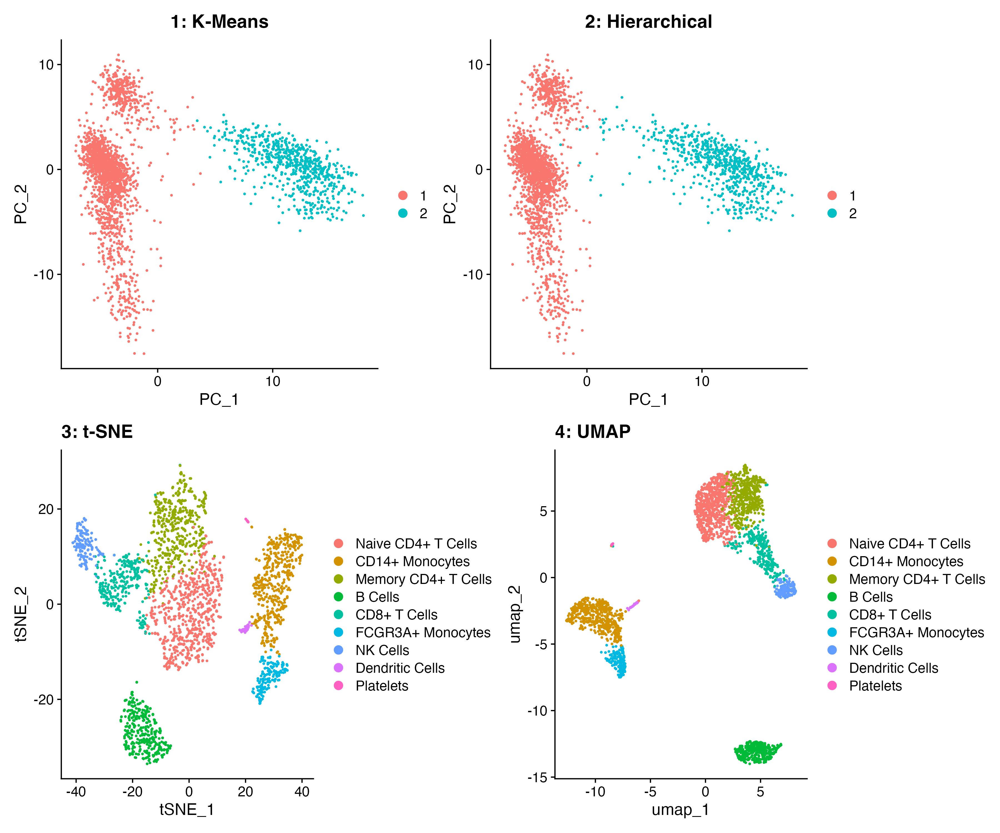
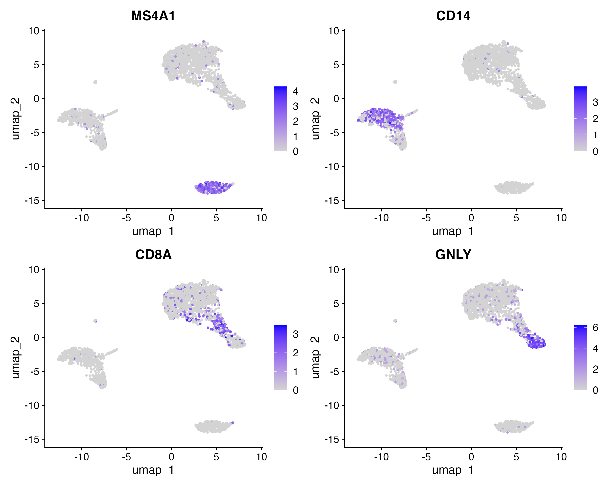
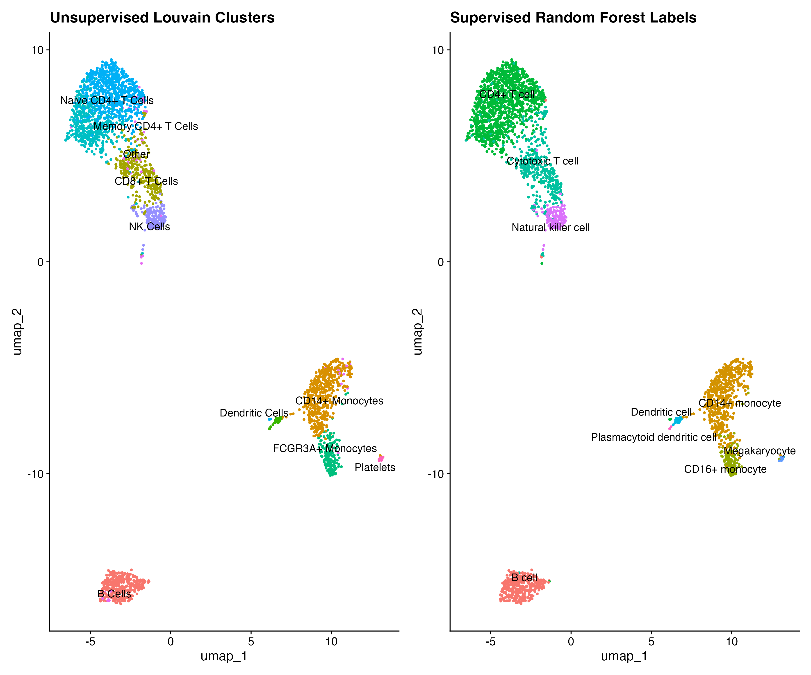
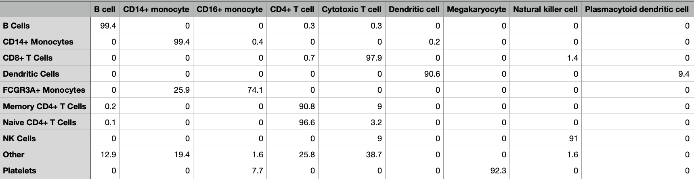
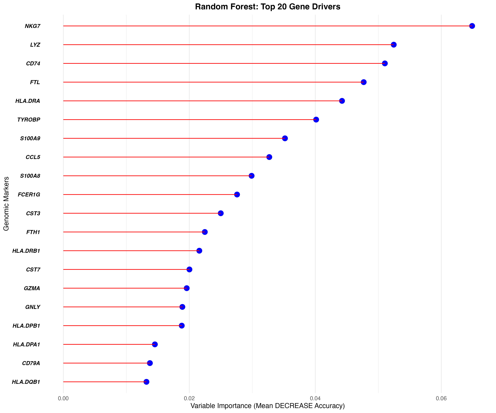
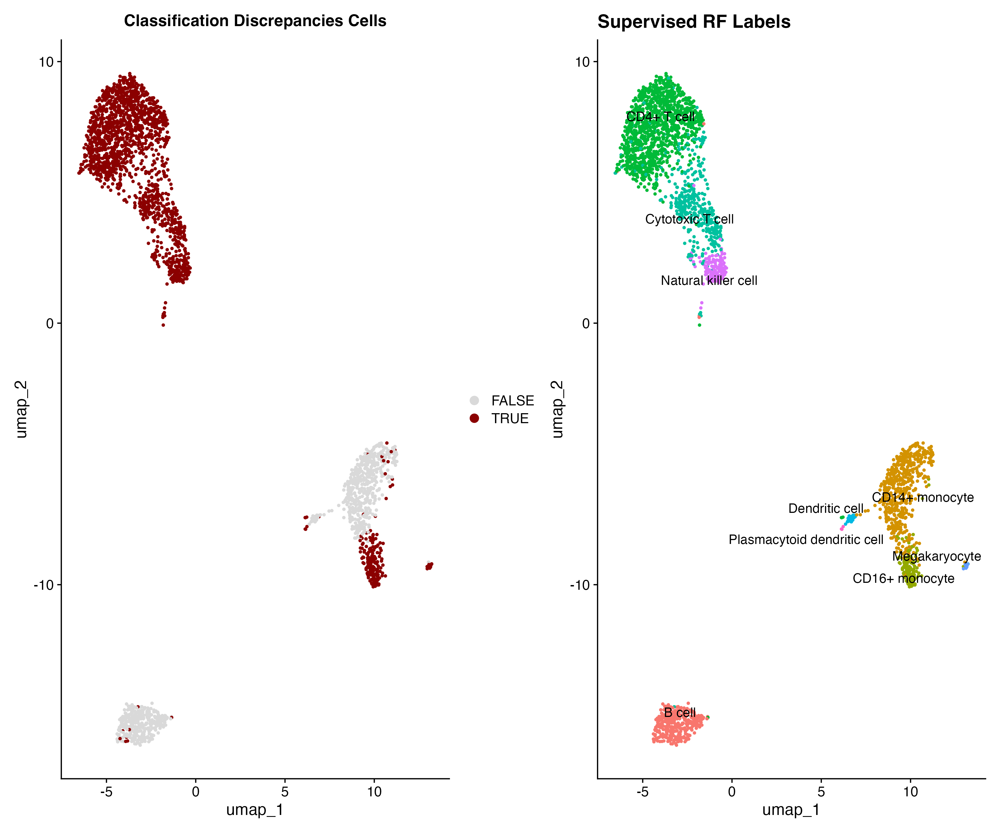

# For C-SEQTEC Committee's Consideration : Single-Cell Pipeline: pbmc2700

Query: An end-to-end reproducible pipeline analyzing 2,700 Human Peripheral Blood Mononuclear Cells (PBMCs). This project explores the evolution of models of single-cell clustering strategies, maps 2 non-linear dimensional reductions, and a Random Forest (RF) model to classify cell lineages across high-dimensional spaces.

## Pipeline Architecture
* `src/01_download_data.sh`: Bash script for data downlod and extraction.
* `src/02_analysis.R`: R script for data transformations, various clustering, and ML non-linear boundary models.

## Progression 

### 1. The Evolution of Single-Cell Clustering
Compared three methods to determine clustering efficiency:
* **K-Means:** Restricts data points into rigid, equal-sized spherical clusters. This approach fails to capture continuous developmental trajectories or irregular biological distributions.
* **Hierarchical:** Accurately captures relationships between cells, however there is a problem with a computational complexity from $O(N^2)$ to $O(N^3)$. 
* **Graph-Based (Louvain Modularity):** Builds a Shared Nearest Neighbor (SNN) graph layout that scales linearly. This model efficiently isolates irregular populations without assuming fixed spherical shapes.




### 2. Verification by Canonical Markers
Validate the unsupervised clustering methods and results by generating expression maps for canonical lineage markers. Notably, **`MS4A1`** cleanly marks the B-cell cluster, confirming the biological accuracy of our groupings.



### 3. Supervised Reference Classification & Evaluation (Random Forest - RF)
Used the benchmark training data benchmark from Systematic comparison of single-cell, Nat. Biotech 2020, which profiled a total of 31,021 human PBMCs using 10x Chromium (v2). Trained a 5-fold CV on 80/20 training/test set then fitted RF model to predict Labels of query dataset.  




Used Louvain and RF classification Labels to determine the proportion of congruence.




### 4. Predictive Gene Driver vs. Canonical Markers
Top 20 gene drivers plot is in stark contrast to the canonical markers plot. Researchers rely on low-abundance receptors like **`CD14`** to name Monocytes, but these transcripts suffer from dropout (false zeros). However, RF prefers abundant, dominant transcripts like **`LYZ`** , **`S100A8`** , and **`S100A9`** to construct a stable classification strategy.




### 5. Discrepancy Analysis 
Louvain is not the absolute biological truth. However, use Louvain clusters as an unbiased, unsupervised baseline of the raw data structure. By mapping the supervised Random Forest Labels, the discrepancy analysis allows us to spot exactly where mathematical clustering and supervised biological memory **disagree**. These are the most interesting or ambiguous cell population.



### 6. Downstream Diagnostics & Validation Audit
The main focal point of this pipeline is the validation of the supervised Random Forest (RF) classifier against unsupervised data-driven structures and canonical biological markers. Rather than accepting the model's classifications blindly, a visual and spatial audit was conducted.

### Observed Discrepancy in Lineage Mapping
When evaluating the UMAP projections, an explicit spatial mismatch was identified between the RF predictions and the ground-truth biological expression:
* **Canonical Marker Expression:** The definitive B-cell marker **`MS4A1`** cleanly lights up exclusively in the **bottom-right** cluster of the UMAP embedding.
* **Random Forest Classification:** The categorical "B-cell" labels assigned by the RF model map erroneously to the **bottom-left** cluster.

### Technical & Biological Hypotheses
This discrepancy is openly presented as a primary diagnostic checkpoint. Two main hypotheses can be considered, at this point:

1. **Coordinates Misalignment (Technical):** The UMAP embeddings generated on different objects or during different integration stages will not automatically align. 
2. **Feature Mapping & Batch Bias (Computational):** A misalignment in the highly variable gene features between the training reference and this 2,700 PBMC query dataset.

### Possible Next Steps: 
* Look at exact metadata and coordinate matrices so that both plots are strictly bound to the exact same local object.
* Try other models without being restricted to the model's confusion matrix and Kappa statistics and focus more on visual coordinate placement.


## Local Replication Guidelines
```bash
git clone [https://github.com/kiyounghan/pbmc2700.git](https://github.com/kiyounghan/pbmc2700.git)
cd pbmc2700
bash src/01_download_data.sh
Rscript src/02_analysis.R
