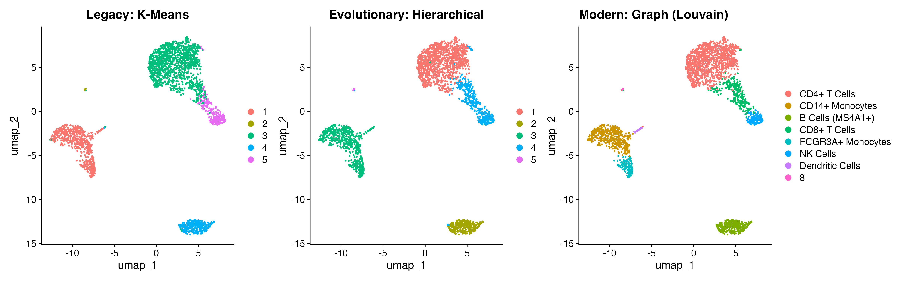
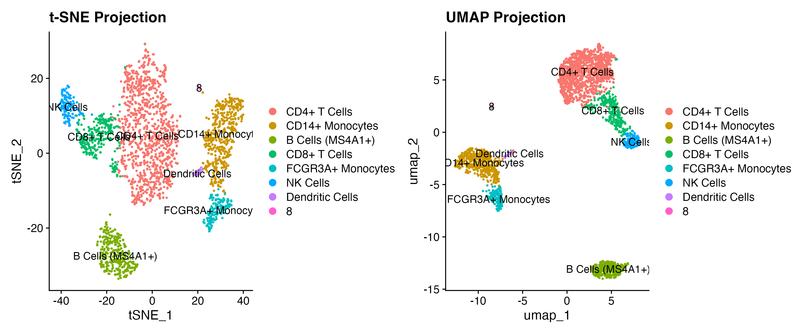
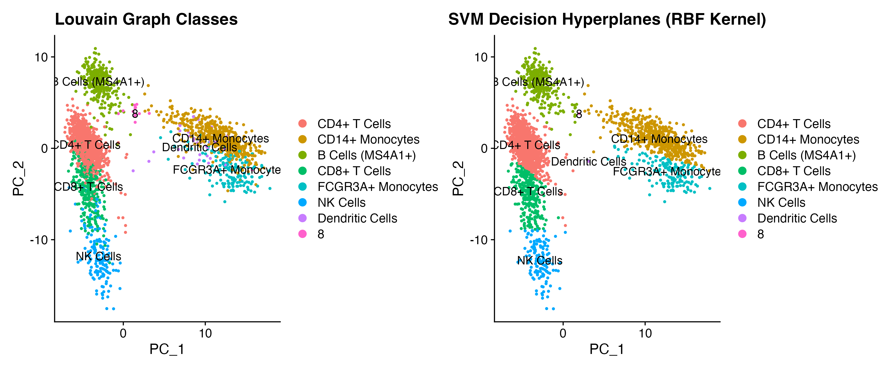

# Single-Cell Pipeline: pbmc2700

An end-to-end reproducible pipeline analyzing 2,700 Human Peripheral Blood Mononuclear Cells (PBMCs). This project explores the evolution of models of single-cell clustering strategies, maps 2 non-linear dimensional reductions, and a Support Vector Machine (SVM) model to classify cell lineages across high-dimensional spaces.

## Pipeline Architecture
* `src/01_download_data.sh`: Bash script for data downlod and extraction.
* `src/02_analysis.R`: R script for data transformations, various clustering, and ML non-linear boundary models.

## Progression 

### 1. The Evolution of Single-Cell Clustering
Compared three methods to determine clustering efficiency:
* **K-Means:** Restricts data points into rigid, equal-sized spherical clusters. This approach fails to capture continuous developmental trajectories or irregular biological distributions.
* **Hierarchical:** Accurately captures relationships between cells, however there is a problem with a computational complexity from $O(N^2)$ to $O(N^3)$. 
* **Graph-Based (Louvain Modularity):** Builds a Shared Nearest Neighbor (SNN) graph layout that scales linearly. This model efficiently isolates irregular populations without assuming fixed spherical shapes.



### 2. Two Non-Linear Projections (t-SNE vs. UMAP)
Computed parallel embeddings using the top 10 PCs. t-SNE prioritizes local clusters and UMAP preserves global relationships.



### 3. Verification by Canonical Markers
Validate the unsupervised clustering methods and results by generating expression maps for canonical lineage markers. Notably, **`MS4A1`** cleanly marks the B-cell cluster, confirming the biological accuracy of our groupings.


### 4. Supervised Reference Classification (SVM Kernel=RBF)
Support Vector Machine utilizing a **Radial Basis Function (RBF) Kernel** on the principal component coordinates. This model projects overlapping populations into a simulated high-dimensional space, drawing clear mathematical borders (hyperplanes) right between distinct cell types.



## Local Replication Guidelines
```bash
git clone [https://github.com/kiyounghan/pbmc2700.git](https://github.com/kiyounghan/pbmc2700.git)
cd pbmc2700
bash src/01_download_data.sh
Rscript src/02_analysis.R
